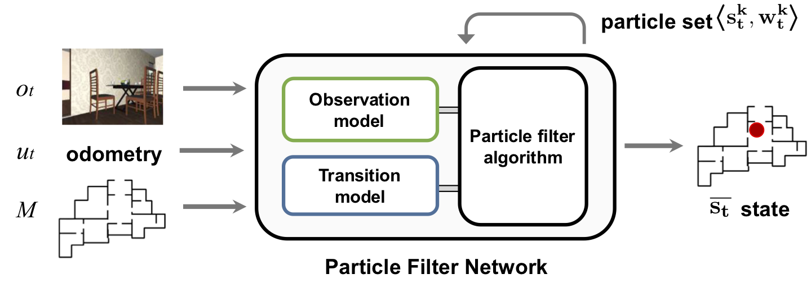
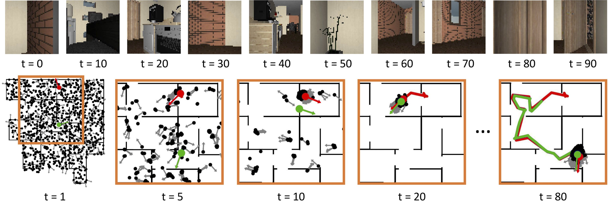

# Particle Filter Networks

Tensorflow implementation of Particle Filter Networks (PF-net)

Peter Karkus, David Hsu, and Wee Sun Lee:  Particle filter networks with application to visual localization.
Conference on Robot Learning (CoRL), 2018. https://arxiv.org/abs/1805.08975

### PF-net architecture
<br>
PF-net encodes both a learned probabilistic system model and the particle filter algorithm in a single neural network

### Localization example
<br>
Example for successful global localization


### Requirements

Python 2.7, Tensorflow 1.5.0

Additional packages can be installed with
```
pip install -r requirements.txt
```

### Dataset

Datasets for localization experiments are available at
https://drive.google.com/open?id=1hSDRg7tEf2O1D_NIL8OmVdHLN2KqYFF7

The folder contains data for training,  validation and testing, in
tfrecords format. Download to the ./data/ folder.

A simple script is available to visualize the data:
```
python display_data.py ./data/valid.tfrecords
```


### Training

The ```./configs/``` folder contains default configuration files for training and evaluation.
Training requires the datesets to be downloaded into the ./data/ folder.
Note that training requires significant resources, and it may take several hours or days depending on the hardware.

PF-net can be trained with the default configuration using the following command:
```
python train.py -c ./configs/train.conf --obsmode rgb
```

By default, logs will be saved in a new folder under ./logs/.
For help on the input arguments run
```
python train.py -h
```


### Evaluation

A pre-trained model for RGB input is available under ./data/rgb_model_trained.chk. For evaluating a trained model run
```
python evaluate.py -c ./configs/eval-tracking.conf --load ./data/rgb_model_trained.chk
```
for the tracking task, and
```
python evaluate.py -c ./configs/eval-localization.conf --load ./data/rgb_model_trained.chk
```
for semi-global localization.
The input arguments are the same as for train.py.
Results will be somewhat different from the ones in
the paper, because the initial uncertainty on the test trajectories
uses a different random seed.

### Contact

Peter Karkus <karkus (at) comp.nus.edu.sg>